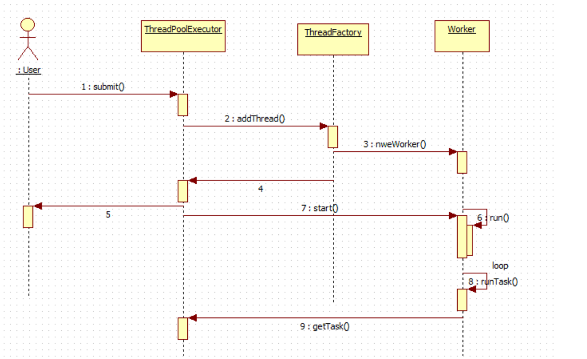
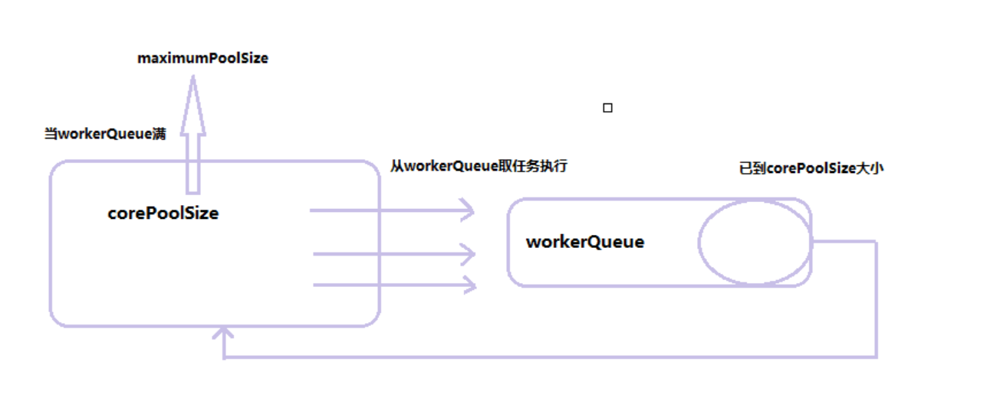

# 线程池的工作机制及其原理

## 1、线程池的核心的两个队列

```text
线程等待池：即线程队列BlockingQueue
任务处理池（Poolworker）：即正在工作的Thread列表（HashSet<Worker>）
```

## 2、线程池的核心参数

```text
核心池的大小（corePoolSize）：即固定大小，设定好之后，线程池的稳定峰值，达到这个值之后池的线程数大小不会释放
最大处理线程池数（maximumPoolSize）：当线程池里面的线程数超过corePoolSize，小于maximumPoolSize时会动态创建与回收线程池里面的线程资源
```

```text
线程池按以下行为执行任务：

当线程数小于核心线程数时，创建线程。
当线程数大于等于核心线程数，且任务队列未满时，将任务放入任务队列。
当线程数大于等于核心线程数，且任务队列已满
若线程数小于最大线程数，创建线程
若线程数等于最大线程数，抛出异常，拒绝任务
```





  


